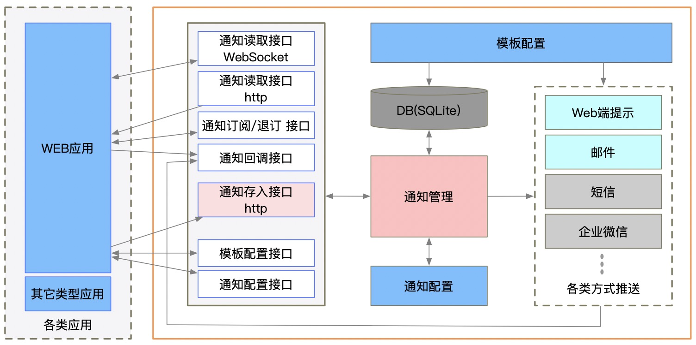

# NoticeServices 通用的通知服务


通用的通知服务支持Android、IOS、web、短信、邮件、企业微信等通知消息的统一可配置管理与发送。支持通知模板、信息发送模板等配置。可以为多个业务应用提供通知消息发送服务。

支持功能：

- 即时推送
- 预约推送
- 定期推送

支持多种发送通道：

- 邮件
- webhook （可配置多个）
- web （http api接口方式）
- 短信 （阿里云、腾讯云）
- 企业微信

 

## 逻辑架构图




## 技术栈

基础框架：[GoFrame](https://github.com/gogf/gf) 【 [中文文档](https://goframe.org/index) 】

数据库：SQLite   【 [中文文档](https://doc.yonyoucloud.com/doc/wiki/project/sqlite/sqlite-intro.html) 】      *GO驱动使用  github.com/mattn/go-sqlite3* 【 [接口文档](https://godoc.org/github.com/mattn/go-sqlite3) 】

目录结构说明：

参考基础框架中的说明 【[项目结构](https://itician.org/pages/viewpage.action?pageId=3670259#id-%E6%96%B0%E5%BB%BA%E9%A1%B9%E7%9B%AE-%E9%A1%B9%E7%9B%AE%E7%BB%93%E6%9E%84) 】

[公共通知服务API](https://docs.apipost.cn/view/673660105ab26470)


## 通知数据

```
{
    "app_id":"dfasdfasdf",
    "config_id":"3eb5e3d5cd2c71ef6fce3f391c9eabcd",
    "come_from":"xxxadf",
    "method":"instant",
    "method_num":2,
    "method_task":"*",
    "msg_title":"3556777744系統故障了",
    "msg_body":"我们的内容信息",
    "msg_url":"http://www.aaa.com/aafd",
    "user_ids":"aaaa|bbbb|cccc",
    "party_ids":"",
    "totag":[{"name":"mail","value":"940290@qq.com"},{"name":"webhook","value":"cccc"}]
}
```

method：信息的任务方式，取值范围为：instant、appointment、regular

instant：即时发送
appointment：预约发送
regular：定期发送


## 使用说明


### 通知配置与模板配置
一个业务需要发送通知，需要在通知服务中创建一个通知配置。并配置这个通知采用哪儿些发送通道进行发送通知。并且针对选择的通道设置发信模板信息。


### 短信发送

发送内容如果是多个值的，msg_body中的内容要采用|分割。每个值对应短信模板中的可替换变量。


## 关于build.sh编译脚本

在使用build.sh脚本进行程序编译的时候，提示
```
fatal: No names found, cannot describe anything.
./build.sh linux|windows|mac

```
是因为源码没有进行git版本的标签设置。

支持将git的tag编译到程序中。需要创建git的tag。只有创建了tag，编译的程序才会显示版本号。

```
git tag v0.0.1

git push origin v0.0.1
```


## 感谢 JetBrains

<a href="https://www.jetbrains.com/?from=Mybatis-PageHelper" target="_blank">
</a>